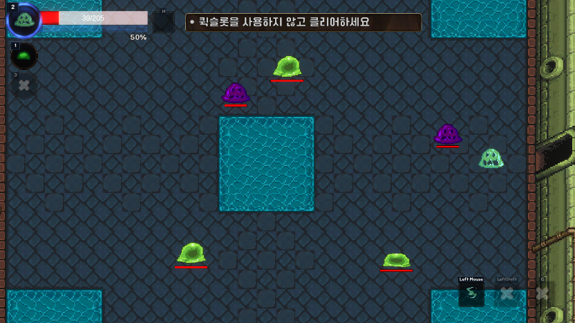

# Slime Project
### 슬라임을 조종해서 적을 흡수하고, 변신을 하는 로그라이크 게임입니다.

 

# 게임 설명

- **슬라임이 적을 흡수하면 흡수율이 올라갑니다.**

#

 

- **흡수율이 오르면 적으로 변신할 수 있습니다.**
- **적으로 변신해서 동화율을 모으면 스탯과 선택 스탯을 얻을 수 있습니다.**

#

 

- **스테이지는 적 구역과, 랜덤 구역, 요리 구역, 채집 구역, 보스 구역이 있습니다.**
- **랜덤 구역은 저주 구역, 회복 구역, 적 구역중 하나가 랜덤으로 나옵니다.**
- **저주 구역은 저주를 받게 되고, 회복 구역은 회복 또는 저주 제거 효과를 받게 됩니다.**

 

#

 

- **요리 구역에서는 적을 처치하고 나온 전리품을 사용해서 요리를 할 수 있습니다.**

#

 

- **채집 구역에서는 채집을 해서 회복 아이템을 얻을 수 있습니다.**

#

 

- **보스 구역은 스테이지 마지막에 있고, 보스를 잡으면 스테이지를 클리어 할 수 있습니다.**

#

 

- **인벤토리에서는 가지고 있는 아이템을 볼 수 있습니다.**
- **스탯창에서는 가지고 있는 스탯을 확인할 수 있고, 스탯을 레벨을 사용해서 올릴 수 있습니다.**
- **도감에서는 적을 볼 수 있고, 흡수율과 동화율을 확인할 수 있습니다.**

 

 

 

# [게임 플레이 영상](https://www.youtube.com/watch?v=X81whpbdbBc)

